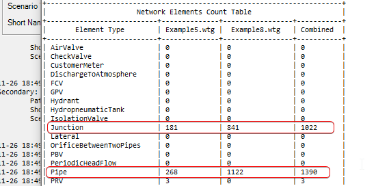

# Merge two or more WaterGEMS/WaterCAD/WaterOPS models together via submodel export/import

Easily combine/join/import/merge two or more Water ([WaterGEMS](https://www.bentley.com/en/products/product-line/hydraulics-and-hydrology-software/watergems)/[WaterCAD](https://www.bentley.com/en/products/product-line/hydraulics-and-hydrology-software/watercad)/WaterOPW) models together using OpenFlows API and [WaterObjects.NET](https://communities.bentley.com/products/hydraulics___hydrology/w/hydraulics_and_hydrology__wiki/17459/waterobjects-net---extending-the-capabilities-of-your-openflows-product) API.

## Download

Make sure to download the right version of the application. The OpenFlows-Water (OFW) is relative new API, so newer version of Water products are currently supported

### [Download v10.4.x.x](OFW.ModelMerger/_setup.bat)

## Setup (Must Do!)

After extracting the contents from the compressed file, paste them over to the installation directory (typically: `C:\Program Files (x86)\Bentley\WaterGEMS\x64`).

## How to run

Open up the `OFW.ModelMerger.exe` and screen like below loads.


### Primary model

1. Select the base model (primary) on which the other model will be imported to combine the two together.
2. [Optional but recommended] Give a short, 3 to 6 letter long, name (acronym)
   1. All the labels in the model will be updated with this short name, except the scenario/alternative/cacl. options to be merged
3. If needed, change the model to the right scenario

### Secondary model

1. Select the other model (secondary which will get imported to the primary model).
2. [**Important**] Give a short, 3 to 6 letter long, name (acronym)
   1. All the labels in the model will be updated with this short name, except the scenario/alternative/cacl. options to be merged
3. If needed, change the model to the right scenario

## Review the summary

Click on the `Report` button and review the summary. Please double check the combined model in the main (WaterGEMS) UI. It is expected to have the imported model at a different location. A selection set of the secondary model is created to move the elements to the right location.

Feel free to log bugs for any issue discovered and thanks!



### Sample Report [Expandable]

<details>
  <summary>Exapand this to see a sample summary output. This is generated where Example5 is the primary and Example 8 is the secondary.</summary>

```bat

*****************************************************************
* Model Merger Summary Report 
*****************************************************************


Primary:
	Path:       C:\Program Files (x86)\Bentley\WaterGEMS\Samples\Example5.wtg
	Short Name: Ex5
	Scenario:   Historical SCADA Simulation


Secondary:
	Path:       C:\Program Files (x86)\Bentley\WaterGEMS\Samples\Example8.wtg
	Short Name: Ex8
	Scenario:   Optimized Leakage Detection - hr 0 to 4 (uncalibrated e) - 3


+------------------------------------------------------------------------+
|                      Network Elements Count Table                      |
+---------------------------+--------------+-----------------+-----------+
|       Element Type        | Example5.wtg |  Example8.wtg   | Combined  |
+---------------------------+--------------+-----------------+-----------+
| AirValve                  | 0            | 0               | 0         |
| CheckValve                | 0            | 0               | 0         |
| CustomerMeter             | 0            | 0               | 0         |
| DischargeToAtmosphere     | 0            | 0               | 0         |
| FCV                       | 0            | 0               | 0         |
| GPV                       | 0            | 0               | 0         |
| Hydrant                   | 0            | 0               | 0         |
| HydropneumaticTank        | 0            | 0               | 0         |
| IsolationValve            | 0            | 0               | 0         |
| Junction                  | 181          | 841             | 1022      |
| Lateral                   | 0            | 0               | 0         |
| OrificeBetweenTwoPipes    | 0            | 0               | 0         |
| PBV                       | 0            | 0               | 0         |
| PeriodicHeadFlow          | 0            | 0               | 0         |
| Pipe                      | 268          | 1122            | 1390      |
| PRV                       | 3            | 0               | 3         |
| PSV                       | 0            | 0               | 0         |
| Pump                      | 2            | 0               | 2         |
| PumpStation               | 0            | 0               | 0         |
| Reservoir                 | 1            | 1               | 2         |
| RuptureDisk               | 0            | 0               | 0         |
| SCADAElement              | 7            | 0               | 7         |
| SpotElevation             | 0            | 0               | 0         |
| SurgeTank                 | 0            | 0               | 0         |
| SurgeValve                | 0            | 0               | 0         |
| Tank                      | 1            | 1               | 2         |
| Tap                       | 0            | 0               | 0         |
| TCV                       | 0            | 240             | 240       |
| Turbine                   | 0            | 0               | 0         |
| ValveWithLinearAreaChange | 0            | 0               | 0         |
| VSPB                      | 0            | 0               | 0         |
| -------------------       |              |                 |           |
| Pipe length               | 52,003 m     | 172,415.2492 ft | 104,556 m |
| Lateral length            | 0 m          | 0 ft            | 0 m       |
+---------------------------+--------------+-----------------+-----------+
+--------------------------------------------------------------------------+
|                            Components Summary                            |
+---------------------------------+--------------+--------------+----------+
|      Model Components Type      | Example5.wtg | Example8.wtg | Combined |
+---------------------------------+--------------+--------------+----------+
| EnergyPricing                   | 1            | 2            | 3        |
| GpvHeadlossCurve                | 0            | 0            | 0        |
| Constituent                     | 2            | 1            | 3        |
| ControlAction                   | 5            | 0            | 5        |
| ControlCondition                | 10           | 0            | 10       |
| Control                         | 5            | 0            | 5        |
| LogicalControlSet               | 2            | 0            | 2        |
| Pattern                         | 10           | 17           | 27       |
| PumpDefinition                  | 4            | 1            | 5        |
| PressureDependentDemandFunction | 0            | 0            | 0        |
| UnitDemandLoad                  | 0            | 0            | 0        |
| Zone                            | 6            | 1            | 7        |
+---------------------------------+--------------+--------------+----------+
+----------------------------------------------------------------------+
|                 Scnro / Alt / Calcs / SelSet Summary                 |
+-----------------------------+--------------+--------------+----------+
|            Name             | Example5.wtg | Example8.wtg | Combined |
+-----------------------------+--------------+--------------+----------+
| Selection Set               | 7            | 34           | 41       |
| Scenario                    | 10           | 2            | 1        |
| Calc Options EpaNet         | 9            | 1            | 1        |
| Calc Options Hammer         | 1            | 1            | 1        |
| -------------------         |              |              |          |
| Alternative Types           |              |              |          |
|    Age                      | 1            | 1            | 1        |
|    Constituent              | 2            | 1            | 1        |
|    Demand                   | 1            | 2            | 1        |
|    EnergyCost               | 1            | 1            | 1        |
|    FireFlow                 | 2            | 1            | 1        |
|    Flushing                 | 1            | 1            | 1        |
|    Hammer                   | 1            | 1            | 1        |
|    HMIActiveTopology        | 4            | 1            | 1        |
|    HmiDataSetGeometry       | 1            | 1            | 1        |
|    HMIDataSetTopology       | 1            | 1            | 1        |
|    HMIUserDefinedExtensions | 1            | 1            | 1        |
|    InitialSettings          | 5            | 1            | 1        |
|    Operational              | 2            | 1            | 1        |
|    Physical                 | 4            | 3            | 1        |
|    PipeBreak                | 1            | 1            | 1        |
|    PressureDependentDemand  | 1            | 1            | 1        |
|    Scada                    | 1            | 1            | 1        |
|    Trace                    | 1            | 1            | 1        |
+-----------------------------+--------------+--------------+----------+
+------------------------------------+
| Example5.wtg: Pipe Diameter Summ.. |
+---------------+-------+------------+
| Diameter (mm) | Count | Length (m) |
+---------------+-------+------------+
| 100.0         | 87    | 17,340     |
| 101.6         | 1     | 155        |
| 150.0         | 84    | 16,472     |
| 200.0         | 31    | 5,654      |
| 203.2         | 1     | 109        |
| 304.8         | 3     | 763        |
| 50.0          | 43    | 6,823      |
| 600.0         | 18    | 4,689      |
+---------------+-------+------------+
+----------------------------------------+
| Example8.wtg: Pipe Diameter Summary .. |
+---------------+----------+-------------+
| Diameter (in) |  Count   | Length (ft) |
+---------------+----------+-------------+
| 1.2           | 2.0000   | 92.3556     |
| 11.8          | 1.0000   | 34.5144     |
| 2.0           | 20.0000  | 6,491.2983  |
| 2.9           | 48.0000  | 15,697.5722 |
| 20.0          | 2.0000   | 17.5853     |
| 3.0           | 179.0000 | 49,452.5457 |
| 3.1           | 6.0000   | 1,301.4108  |
| 3.5           | 6.0000   | 888.3858    |
| 3.9           | 112.0000 | 28,191.0105 |
| 4.0           | 1.0000   | 1,067.8478  |
| 4.1           | 4.0000   | 144.0289    |
| 4.8           | 34.0000  | 9,038.7139  |
| 4.9           | 2.0000   | 11.4173     |
| 5.2           | 25.0000  | 8,320.7161  |
| 5.5           | 1.0000   | 2.9528      |
| 5.6           | 1.0000   | 23.7205     |
| 5.7           | 10.0000  | 1,950.9127  |
| 5.8           | 104.0000 | 26,540.0261 |
| 5.9           | 3.0000   | 471.5551    |
| 6.0           | 1.0000   | 52.4934     |
| 6.8           | 1.0000   | 260.3346    |
| 7.4           | 3.0000   | 139.8622    |
| 7.8           | 14.0000  | 2,422.3356  |
| 7.9           | 2.0000   | 15.3543     |
| 8.8           | 35.0000  | 15,863.3531 |
| 9.2           | 7.0000   | 79.4948     |
| 9.8           | 18.0000  | 3,363.4515  |
| 99.0          | 480.0000 | 480.0000    |
+---------------+----------+-------------+
+------------------------------------+
| Example5.wtg: Pipe Diameter Summ.. |
+---------------+-------+------------+
| Diameter (mm) | Count | Length (m) |
+---------------+-------+------------+
| 100.0         | 88    | 17,418     |
| 101.0         | 1     | 325        |
| 101.6         | 1     | 155        |
| 102.9         | 4     | 44         |
| 123.0         | 34    | 2,755      |
| 125.0         | 2     | 3          |
| 130.9         | 25    | 2,536      |
| 140.0         | 1     | 1          |
| 142.0         | 1     | 7          |
| 144.0         | 10    | 595        |
| 147.3         | 1     | 287        |
| 148.0         | 103   | 7,802      |
| 149.7         | 1     | 42         |
| 150.0         | 86    | 16,574     |
| 152.4         | 1     | 16         |
| 172.0         | 1     | 79         |
| 187.1         | 3     | 43         |
| 199.0         | 14    | 738        |
| 2,514.6       | 480   | 146        |
| 200.0         | 33    | 5,659      |
| 203.2         | 1     | 109        |
| 224.0         | 35    | 4,835      |
| 233.9         | 7     | 24         |
| 249.0         | 18    | 1,025      |
| 299.0         | 1     | 11         |
| 30.0          | 2     | 28         |
| 304.8         | 3     | 763        |
| 50.0          | 50    | 8,136      |
| 508.0         | 2     | 5          |
| 51.5          | 13    | 665        |
| 600.0         | 18    | 4,689      |
| 73.6          | 48    | 4,785      |
| 75.0          | 1     | 36         |
| 76.0          | 178   | 15,037     |
| 80.0          | 6     | 397        |
| 90.0          | 6     | 271        |
| 98.0          | 1     | 1          |
| 99.0          | 110   | 8,513      |
+---------------+-------+------------+

```

</details>


## How it works

### Simplification

* Simplifies the label for both primary model. All the labels are modified except the active scenario, alternative, and calculation options
* Create a base scenario called `Merged` which is identical to the active scenario and deletes the rest
* Merges alternatives all the way up to the base/root
* Deletes all the calculations except the active ones

### Export the secondary model as submodel

* Selects all the elements in the secondary model and exports to a submodel. Path is `%temp%\__ModelMerger\`.

### Import the submodel into the primary model

* Imports the submodel exported in the temp directory. After the completion of the import, the submodel from the temp path is deleted.

## How to combine 3 or more models together

First combine the two models together, save it. Close the application and use this combined model as primary model. Open up the third model as secondary.

## Other projects based on OpenFlows Water and/or WaterObjects.NET

* [Isolation Valve Adder](https://github.com/worthapenny/OpenFlows-Water--IsolationValveAdder)
* [Bing Background Adder](https://github.com/worthapenny/OpenFlows-Water--BingBackground)
* [Model Merger](https://github.com/worthapenny/OpenFlows-Water--ModelMerger)
* [Demand to CustomerMeter](https://github.com/worthapenny/OpenFlows-Water--DemandToCustomerMeter)

## Did you know?

Now, you can work with Bentley Water products with python as well. Check out:

* [Github pyofw](https://github.com/worthapenny/pyofw)
* [PyPI pyofw](https://pypi.org/project/pyofw/)


